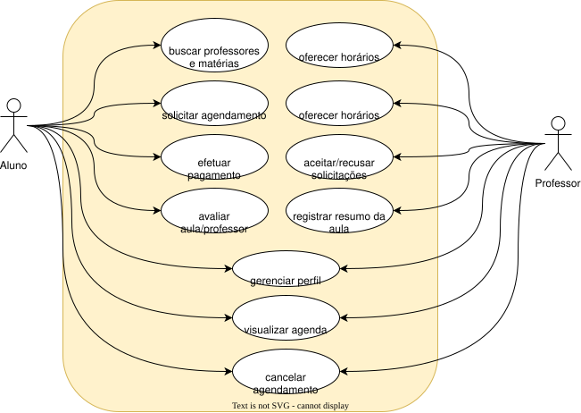

# 3. Definição de Requisitos do Sistema

---

## 3.1. Requisitos Funcionais do Sistema

### 3.1.1. Diagramas de Caso de Uso

> **Instruções:** Crie os diagramas com o draw.io, conectado a esse repositório. Salve o diagrama no formato nativo .drawio (para poder editar depois) e também como uma imagem .svg (melhor) ou .png
> Depois, adicione a imagem a esse texto com o formato nos exemplos abaixo:
> **`[Sujeito] + DEVERÁ + [Ação/Comportamento] + [Condição ou Restrição]`**

##### Diagrama de Casos de Uso Geral do Sistema (Diagrama de Contexto):

##### Diagrama de um Caso de Uso complexo

> **Instruções** Crie um ou dois diagramas de algum caso de uso mais complexo do seu sistema 

### 3.1.2. Requisitos Funcionais

> **Instruções:** Escreva todos os requisitos obrigatoriamente na sintaxe padronizada pela ISO 29148:
> **`[Sujeito] + DEVERÁ + [Ação/Comportamento] + [Condição ou Restrição]`**

* **RSYS01:** O sistema **deverá** permitir o cadastro de novos usuários mediante validação de e-mail institucional.
* **RSYS02:** O sistema **deverá** registrar a entrada de insumos no estoque atualizando o saldo em menos de 1 segundo.
* **RSYS03:** O sistema **deverá** emitir um alerta sonoro e visual caso a temperatura do sensor ultrapasse 30°C.
