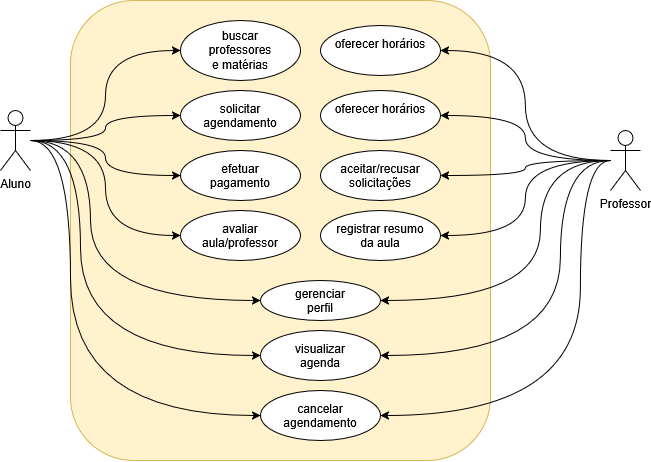

# 3. Definição de Requisitos do Sistema

---

## 3.1. Requisitos Funcionais do Sistema

### 3.1.1. Diagramas de Caso de Uso

> **Instruções:** Crie os diagramas com o draw.io, conectado a esse repositório. Salve o diagrama como uma imagem `.png`, de preferência na pasta `/img`. Se quiser, salve também no formato nativo .drawio (para poder editar depois).
> Depois, faça o link para a imagem nesse texto dessa forma: ``.

##### Diagrama de Casos de Uso Geral do Sistema (Diagrama de Contexto):

##### Diagrama de um Caso de Uso complexo

> **Instruções** Se tiver alguns casos de uso mais mais complexo em seu sistema, poste o diagrama de caso de uso deles aqui. 

### 3.1.2. Requisitos Funcionais

> **Instruções:** Escreva todos os requisitos obrigatoriamente na sintaxe padronizada pela ISO 29148:
> **`[Sujeito] + DEVERÁ + [Ação/Comportamento] + [Condição ou Restrição]`**

* **RSYS01:** O sistema **deverá** permitir o cadastro de novos usuários mediante validação de e-mail institucional.
* **RSYS02:** O sistema **deverá** registrar a entrada de insumos no estoque atualizando o saldo em menos de 1 segundo.
* **RSYS03:** O sistema **deverá** emitir um alerta sonoro e visual caso a temperatura do sensor ultrapasse 30°C.

### 3.1.3 Regras de Negócio

> **Instruções para os alunos:** Regras de Negócio (RN) são as políticas, lógicas de cálculo, condições ou restrições impostas pelo negócio do cliente/instituição. Elas definem **como a empresa/sistema funciona**, independentemente da tecnologia utilizada.
> **Diferença prática:**
>
> * **Requisito Funcional (O que o sistema faz):** *"O sistema deverá permitir o cancelamento de agendamentos."*
> * **Regra de Negócio (A condição/política por trás):** *"Um agendamento só pode ser cancelado se for solicitado com antecedência mínima de 2 horas."*
> 
> Identifique cada regra com a sigla **RN01, RN02...** e vincule aos requisitos do sistema que precisam obedecê-la.

##### RN01 - [Nome curto da Regra]

* **Descrição:** [Descreva a política, cálculo, condição ou limitação de forma clara e objetiva.]
* **Requisitos Associados:** [Informe os requisitos afetados por esta regra, ex.: RSYS01, RSYS02]

##### RN02 - [Nome curto da Regra]

* **Descrição:** [Descreva a política, cálculo, condição ou limitação de forma clara e objetiva.]
* **Requisitos Associados:** [Ex.: RSYS03]

---

#### Exemplos de Preenchimento para Orientação:

##### RN01 - Idade Mínima para Cadastro

* **Descrição:** Apenas usuários com idade igual ou superior a 18 anos podem se cadastrar na plataforma como prestadores de serviço.
* **Requisitos Associados:** RSYS01

##### RN02 - Concessão de Desconto

* **Descrição:** Clientes que acumularem 5 compras no mesmo mês recebem automaticamente 10% de desconto no valor total da próxima compra.
* **Requisitos Associados:** RSYS02

##### RN03 - Bloqueio de Estoque

* **Descrição:** Um produto adicionado ao carrinho de compras fica reservado no estoque por no máximo 15 minutos; após esse tempo sem finalização do pagamento, o item retorna ao estoque disponível.
* **Requisitos Associados:** RSYS02, RSYS03