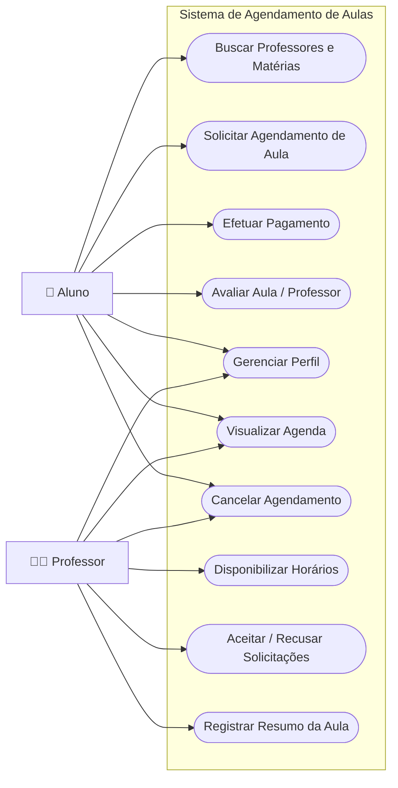

diagrama:

```mermaid
graph LR
    %% Atores
    Aluno["👤 Aluno"]
    Professor["👨‍🏫 Professor"]

    %% Limite do Sistema
    subgraph Sistema ["Sistema de Agendamento de Aulas"]
        %% Casos de Uso Exclusivos do Aluno
        UC1(["Buscar Professores e Matérias"])
        UC2(["Solicitar Agendamento de Aula"])
        UC3(["Efetuar Pagamento"])
        UC4(["Avaliar Aula / Professor"])

        %% Casos de Uso Compartilhados
        UC5(["Gerenciar Perfil"])
        UC6(["Visualizar Agenda"])
        UC7(["Cancelar Agendamento"])

        %% Casos de Uso Exclusivos do Professor
        UC8(["Disponibilizar Horários"])
        UC9(["Aceitar / Recusar Solicitações"])
        UC10(["Registrar Resumo da Aula"])
    end

    %% Relações - Aluno
    Aluno --> UC1
    Aluno --> UC2
    Aluno --> UC3
    Aluno --> UC4
    Aluno --> UC5
    Aluno --> UC6
    Aluno --> UC7

    %% Relações - Professor
    Professor --> UC5
    Professor --> UC6
    Professor --> UC7
    Professor --> UC8
    Professor --> UC9
    Professor --> UC10
```